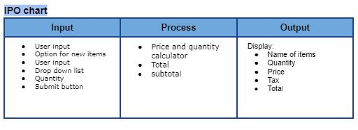

# IT262 - *Food Truck*

Submitted by: **Isaac Jimenez, Mahlet Birhanu, Matthieu Felker**  

[Web App](https://www.project-isaac.com/it262php/Poke-Food-Truck/index.php)

Art by Macrovector / Freepik

## Required Features

The following **required** functionality is completed:

* [x] Allow items to be chosen from a form.
* [x] Display the items chosen and add and display the total cost.
* [x] Allow more than one of each item to be purchased.
* [x] Each item must have at least a <b>name, description</b> and <b>price</b>
* [x] Disallow incorrect data and provide feedback, for example, when a user inputs a string, the data is not processed and the user is informed of the mistake.
* [x]  Changing the objects and their properties must change the form and totals in the form handler.
* [x]  Data for the food truck items must be stored in objects.
* [x] Be built as nearly as possible to [PSR-1](https://www.php-fig.org/psr/psr-1/) and [PSR-2](https://www.php-fig.org/psr/psr-2/) standards.

The following **optional** features are implemented:

* [x] Allows extras to be added to particular items (for example, $.25 cents for adding cheese, etc.)  
## IPO / Flow Chart

## Git Commands
Make sure git is installed by using `git version` in terminal. If no version found, then install git 

Windows, Using VSCode
- Navigation using powershell:
	- Using VSCode, press **CTRL + `** to open powershell terminal in **current directory**
	- In terminal, place git command
- Navigation using mouse:
	- In VSCode, right-click on desired directory file > Open in Integrated Terminal  

|Action|Git Command  | Notes |
|--|--|--|
|  Git Status|`git status`  |Lets you know if git has been initialized on file, branch info... etc.|
|Git Clone| `git clone <github-link>`| Clones project from github to local drive|
|Check all branches|`git branch -a`|Display all local and remote branches
|Create branch|`git branch <branch-name>`|Will create a local branch with name|
|Switch to branch|`git checkout <branch-name>`| Will switch to branch|
|Check branch location|`git status`|Use this command often! Can help track changes to files and branch location|
|Stage all file for commit| `git add .`| Will stage all modified files, ready for commit|
|Commit files|`git commit -m "Added new file"`|Commits staged files with message|
|Push local branch commits to remote branch|`git push -u <remote> <branch name>`|Use `origin` to push your local branch commits to our main github remote|
|Update local files to remote|`git pull`|If you have any unsaved changes, make sure you deal with them before pulling|
|Get all remote branches|`git fetch origin`|Don't see other's branch, use this command|
|Merge Branches| `git merge <file-name>`| **From your branch**, merge main [^1]|

